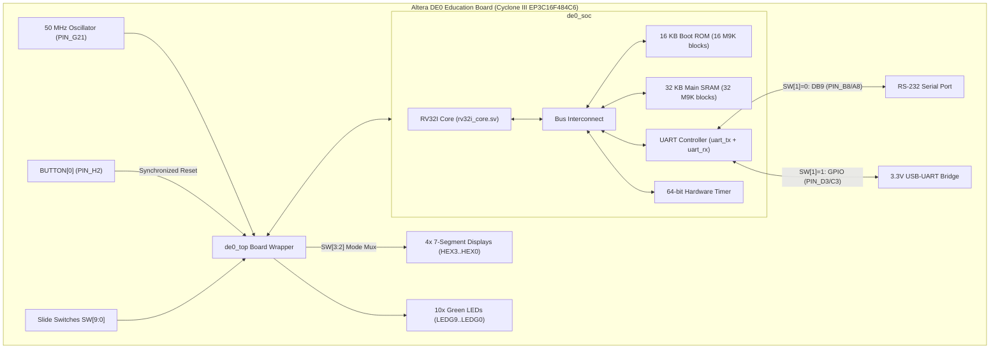

# RV32I SystemVerilog Computer: Altera DE0 FPGA Edition

This branch contains the physical FPGA implementation of the RV32I Computer and SoC tailored for the **Altera / Terasic DE0 Education Board** (Cyclone III EP3C16F484C6), as used in the TU Delft CSE 2420 Digital Systems course.

---

## Hardware Architecture



---

## Board Resource Budget

The Cyclone III EP3C16F484 on the DE0 board provides:
- **Logic Elements**: 15,408 LEs (RV32I core and SoC consume ~2,400 LEs, ~15% utilization).
- **Embedded Memory**: 56 M9K BRAM blocks (504 Kbits = 63 KB maximum total RAM).
- **Clock**: 50 MHz on-board crystal oscillator on `PIN_G21` directly drives the CPU and bus.

### Memory Allocation
- **Boot ROM**: 16 KB (16 M9K blocks preloaded with `$readmemh` during bitstream compilation).
- **Main SRAM**: 32 KB (32 M9K blocks for stack, heap, `.data`, `.bss`).
- **Total BRAM used**: 48 M9K blocks out of 56 (85% utilization, leaving 8 blocks available).

---

## Physical Pin Mapping

| Peripheral | Board Component | Cyclone III Pin | Function |
|---|---|---|---|
| **Clock** | `CLOCK_50` | `PIN_G21` | 50 MHz master oscillator |
| **Reset** | `BUTTON[0]` | `PIN_H2` | Active-low push button (debounced and synchronized) |
| **Soft Reset** | `SW[0]` | `PIN_J6` | Slide switch (UP = Reset active) |
| **UART RX Input** | `SW[1]` | `PIN_H5` | `0`: RS-232 DB9 port (`PIN_A8`), `1`: GPIO0 header (`PIN_C3`) |
| **Display Select** | `SW[3:2]` | `PIN_G4`, `PIN_H6` | `00`: PC, `01`: Inst [15:0], `10`: Inst [31:16], `11`: Exit Code |
| **Status LEDs** | `LEDG[0]` | `PIN_J1` | Game Over / Simulation Exit Trap valid |
| | `LEDG[1]` | `PIN_J2` | UART Transmitter active |
| | `LEDG[2]` | `PIN_J3` | UART Receiver active |
| | `LEDG[3]` | `PIN_H1` | 64-bit Hardware Timer Interrupt (`timer_irq`) |
| | `LEDG[9:4]` | `PIN_B1..PIN_E1` | Status / Result Code bits [5:0] |
| **7-Segments** | `HEX0_D[6:0]` | `PIN_F13..PIN_E11` | Digit 0 (lowest nibble) |
| | `HEX1_D[6:0]` | `PIN_A15..PIN_A13` | Digit 1 |
| | `HEX2_D[6:0]` | `PIN_F14..PIN_D15` | Digit 2 |
| | `HEX3_D[6:0]` | `PIN_G15..PIN_B18` | Digit 3 (highest nibble) |
| **RS-232** | `UART_TXD` | `PIN_B8` | DB9 serial port transmit |
| | `UART_RXD` | `PIN_A8` | DB9 serial port receive |
| **GPIO Header** | `GPIO0_D[0]` | `PIN_D3` | 3.3V UART TX for USB-UART adapters |
| | `GPIO0_D[1]` | `PIN_C3` | 3.3V UART RX for USB-UART adapters |

---

## Building in Quartus Prime / Quartus II

1. Open Quartus II (13.0sp1) or Quartus Prime Lite.
2. Create or open the project targeting device **`EP3C16F484C6`**.
3. Import the pin assignments file:
   - Go to `Assignments -> Import Assignments...`
   - Select `de0_pins.qsf`
4. Set top-level entity to `de0_top`.
5. Compile the design (`Ctrl+L`). Timing Analyzer will verify the 50 MHz clock constraint from `de0_timing.sdc`.
6. Open Programmer (`Tools -> Programmer`), detect **USB-Blaster**, add `output_files/de0_top.sof`, and click **Start**.

---

## Playing Interactive Games on Hardware

### Connection Options

#### Option 1: 3.3V USB-UART Dongle (CP2102, FTDI, CH340)
1. Connect adapter GND to DE0 GPIO0 GND (`PIN 12`).
2. Connect adapter RX to DE0 `GPIO0_D[0]` (`PIN_D3`).
3. Connect adapter TX to DE0 `GPIO0_D[1]` (`PIN_C3`).
4. Set `SW[1]` to **UP**.

#### Option 2: RS-232 DB9 Serial Port
1. Connect a USB-to-RS232 serial cable to the DE0 DB9 port.
2. Set `SW[1]` to **DOWN**.

### Terminal Setup
On your computer, open the serial terminal at 115,200 baud:
```bash
python3 term.py  # Or: screen /dev/cu.usbserial-* 115200
```
Press `BUTTON[0]` on the DE0 board to reset the core. The 7-segment display will show the program counter advancing, and the game will render in your terminal.
