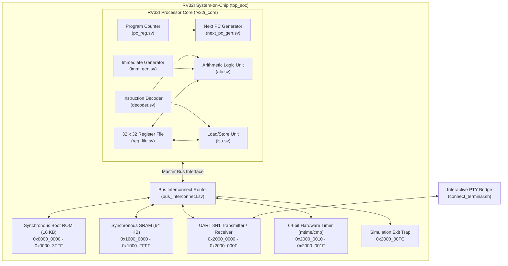

# RV32I SystemVerilog Computer & SoC

A complete, cycle-accurate RISC-V RV32I unprivileged processor core and System-on-Chip (SoC) written in SystemVerilog (IEEE 1800-2012). Built with memory-mapped peripherals, hardware UART (8N1), real-time cycle counter/timer, interactive terminal bridge, and bare-metal software applications including Flappy Bird and Snake.

---

## Architecture Overview



### Core Specifications
- **Instruction Set**: RISC-V RV32I Base Integer Instruction Set (32-bit).
- **Execution Architecture**: Multi-cycle state machine (`S_FETCH` -> `S_EXEC` -> `S_MEM`).
- **Registers**: 32 architectural registers (`x0`-`x31`), `x0` hardwired to 0, dual-read synchronous-write register file.
- **Immediate Formats**: Full hardware support for I-type, S-type, B-type, U-type, and J-type immediate sign-extension.
- **ALU Operations**: 10 operations (`ADD`, `SUB`, `SLL`, `SLT`, `SLTU`, `XOR`, `SRL`, `SRA`, `OR`, `AND`) + `PASS_B` and zero flag.
- **LSU**: Byte-level write strobes (`bus_wstrb[3:0]`) and sign/zero-extension for `LB`, `LH`, `LW`, `LBU`, `LHU`, `SB`, `SH`, `SW`.

---

## Memory Map

| Region | Start Address | End Address | Size | Description |
|---|---|---|---|---|
| **Boot ROM** | `0x0000_0000` | `0x0000_3FFF` | 16 KB | Read-only reset memory (`RESET_VECTOR = 0x0000_0000`). Preloaded via `$readmemh`. |
| **Main SRAM** | `0x1000_0000` | `0x1000_FFFF` | 64 KB | Read/write memory for stack, heap, `.data`, and `.bss`. Stack top: `0x1001_0000`. |
| **UART Data** | `0x2000_0000` | `0x2000_0003` | 4 B | Write: TX data byte. Read: RX data byte (clears RX valid). |
| **UART Status** | `0x2000_0004` | `0x2000_0007` | 4 B | Read: Bit 0 = TX ready (`1`), Bit 1 = RX data available (`1`). |
| **Timer mtime** | `0x2000_0010` | `0x2000_0017` | 8 B | 64-bit cycle counter (`0x10` low word, `0x14` high word). |
| **Timer mtimecmp** | `0x2000_0018` | `0x2000_001F` | 8 B | 64-bit comparator generating level-sensitive interrupt when `mtime >= mtimecmp`. |
| **Sim Exit Trap** | `0x2000_00FC` | `0x2000_00FF` | 4 B | Write `0x1` for pass, non-zero for test failure. Terminates testbench. |

---

## Repository Structure

```
├── rv32i_pkg.sv             # Architectural package: opcodes, enums, structs, bus_if
├── alu.sv                   # Arithmetic Logic Unit
├── reg_file.sv              # 32x32 Register File (x0 tied to zero)
├── imm_gen.sv               # Immediate format sign-extension generator
├── pc_reg.sv                # Program counter register with enable gating
├── next_pc_gen.sv           # Next-PC priority arbitration (JALR > JAL > branch > PC+4)
├── decoder.sv               # Instruction decoder generating ctrl_signals_t
├── lsu.sv                   # Load/Store Unit (alignment, sign-extension, byte strobes)
├── rv32i_core.sv            # Integrated RV32I CPU Core with FSM
├── bus_interconnect.sv      # Address decoder and transaction router
├── rom_sync.sv              # 16 KB Synchronous Boot ROM
├── ram_sync.sv              # 64 KB Synchronous SRAM with byte write mask
├── uart_tx.sv               # UART 8N1 serial transmitter & receiver
├── system_timer.sv          # 64-bit hardware real-time timer
├── top_soc.sv               # Top-level SoC integrating core, bus, memory, peripherals
├── top_soc_tb.sv            # Top-level SoC compliance testbench with UART sniffer
├── run_tests.sh             # Automated compliance test suite runner
├── connect_terminal.sh      # Interactive terminal launcher for games and shells
├── term.py                  # Raw terminal client bridge
├── pty_bridge.c             # Unix PTY / TCP VPI module for Icarus Verilog
├── terminal_tb.sv           # Interactive simulation testbench with VPI bridge
└── sw/                      # Bare-metal software suite
    ├── link.ld              # Bare-metal linker script
    ├── crt0.s               # Startup assembly runtime
    ├── generate_hex.py      # Standalone Python RV32I assembler & hex image generator
    ├── uart.h / uart.c      # UART peripheral drivers
    ├── timer.h / timer.c    # Hardware timer drivers
    ├── basic_math.s         # Arithmetic and logic unit test
    ├── branch_test.s        # Branching and jump verification test
    ├── hello_uart.c / .s    # C string transmission test
    ├── terminal_echo.s      # Interactive keystroke echoing
    ├── flappy_bird.s        # Interactive ANSI terminal Flappy Bird game
    ├── snake.s              # Interactive ANSI terminal Snake game
    └── Makefile             # Software build system (GCC or fallback Python assembler)
```

---

## Quickstart

### Prerequisites
- [Icarus Verilog](https://github.com/steveicarus/iverilog) (`iverilog`, `vvp`):
  ```bash
  # macOS (Homebrew)
  brew install icarus-verilog

  # Ubuntu / Debian
  sudo apt-get install iverilog
  ```
- Python 3.8+ (no external pip dependencies needed).
- Optional: RISC-V GCC cross-compiler (`riscv32-unknown-elf-gcc`). If absent, `generate_hex.py` automatically acts as a pure-Python RV32I assembler.

### 1. Run Automated Test Suite
Compiles the SoC RTL with Icarus Verilog and runs `basic_math`, `branch_test`, and `hello_uart`:
```bash
./run_tests.sh
```

Sample output:
```
======================================================================
 RV32I SystemVerilog Computer: Automated SoC Test Suite
======================================================================
[1/4] Compiling SystemVerilog design and testbench with iverilog...
      Compilation successful -> top_soc_sim.vvp

Running Test: basic_math   -> [PASSED]
Running Test: branch_test  -> [PASSED]
Running Test: hello_uart   -> [PASSED] (UART Output: "Hello, RV32I SystemVerilog Computer!")
======================================================================
Test Suite Summary: Total Tests: 3 | Passed: 3 | Failed: 0
Status: ALL TESTS PASSED SUCCESSFULLY!
======================================================================
```

### 2. Play Interactive Terminal Games

Launch interactive games inside your terminal with keyboard input and ANSI color rendering:

#### Flappy Bird
```bash
./connect_terminal.sh sw/flappy_bird.hex
```
- Controls: `SPACE` to flap upward, `Q` to quit.

#### Snake
```bash
./connect_terminal.sh sw/snake.hex
```
- Controls: `W` (Up), `A` (Left), `S` (Down), `D` (Right), `Q` to quit.

---

## Software Development

To build new assembly or C programs:
```bash
cd sw
make
```
This generates corresponding `.hex` images (ROM) and `_ram.hex` images (RAM) formatted for Verilog `$readmemh`.
