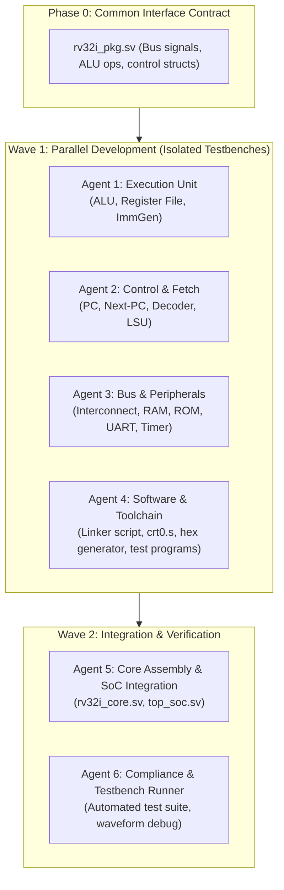

# Agent Delegation Plan: Parallel SystemVerilog Computer Development

To build the computer rapidly without merge collisions or integration friction, split the work into parallel tracks isolated by strict interface boundaries.

## Phase 0: The shared interface contract (Do this first)

Before launching independent agents, define one shared SystemVerilog package file (`rv32i_pkg.sv`). This prevents wire name mismatches and conflicting opcode encodings.

The file must define:
- Control word struct (`alu_op_e`, `imm_src_e`, `wb_sel_e`, `branch_op_e`).
- Bus interface signals (`addr`, `wdata`, `rdata`, `wstrb`, `valid`, `ready`).
- Memory address map constants (`ROM_BASE`, `RAM_BASE`, `UART_BASE`, `TIMER_BASE`).

---

## Wave 1: Parallel streams

### Agent 1: Execution unit
- **Target files**: `alu.sv`, `reg_file.sv`, `imm_gen.sv`.
- **Testbenches**: `alu_tb.sv`, `reg_file_tb.sv`.
- **Scope**:
  - Implements all 10 ALU arithmetic/logic functions and comparison outputs.
  - Implements dual-read synchronous-write register file with `x0` tied to zero.
  - Implements sign extension for I, S, B, U, and J immediate formats.
- **Independence**: Needs only `rv32i_pkg.sv`. Operates purely on registers and combinational logic.

### Agent 2: Control flow and memory interface
- **Target files**: `pc_reg.sv`, `next_pc_gen.sv`, `decoder.sv`, `lsu.sv`.
- **Testbenches**: `control_tb.sv`, `lsu_tb.sv`.
- **Scope**:
  - Implements PC increment, conditional branch offset addition, and indirect jumps.
  - Implements instruction decoder generating the control signals defined in Phase 0.
  - Implements LSU byte sign-extension and 4-bit write strobe generation.
- **Independence**: Uses mock data inputs. Requires no real RAM or ALU to verify branch offset calculations and decode tables.

### Agent 3: System bus and peripherals
- **Target files**: `bus_interconnect.sv`, `ram_sync.sv`, `rom_sync.sv`, `uart_tx.sv`, `system_timer.sv`.
- **Testbenches**: `bus_tb.sv`, `uart_tb.sv`.
- **Scope**:
  - Address decoder that routes transactions to devices based on address bounds.
  - Block RAM and ROM wrappers supporting `$readmemh`.
  - UART transmitter with configurable baud divider and status register.
  - 64-bit cycle counter.
- **Independence**: Independent of the CPU core. Testbench stimulates memory reads/writes via synthetic bus requests.

### Agent 4: Software toolchain and test binaries
- **Target files**: `Makefile`, `link.ld`, `crt0.s`, `generate_hex.py`, test programs (`basic_math.s`, `branch_test.s`, `hello_uart.c`).
- **Scope**:
  - Establishes compilation flow using `riscv32-unknown-elf-gcc`.
  - Configures memory sections matching the memory map.
  - Writes bare-metal C library headers (`uart.h`, `timer.h`).
  - Produces memory hex files (`.hex`) ready for Verilog simulation.
- **Independence**: Pure software work. Requires only the memory map addresses and CPU architecture specification.

---

## Wave 2: Integration and verification

### Agent 5: Core integration (`rv32i_core.sv` and `top_soc.sv`)
- Takes components from Agents 1 and 2 to form `rv32i_core.sv`.
- Connects the core to the bus interconnect and peripherals from Agent 3 to form `top_soc.sv`.
- Resolves top-level timing and connection errors.

### Agent 6: System testbench and compliance runner
- **Target files**: `top_soc_tb.sv`, `run_tests.sh`.
- **Scope**:
  - Loads binaries generated by Agent 4 into ROM/RAM via `$readmemh`.
  - Implements simulation pass/fail traps (such as monitoring writes to a designated host register `0x2000_00FC`).
  - Inspects serial TX output lines and prints simulated terminal output directly to standard out.
