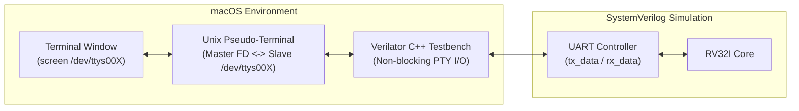

# Implementation Guide: Pseudo-Terminal (PTY) Bridge for SystemVerilog CPU

This guide details how to build an interactive virtual serial terminal on macOS for a SystemVerilog CPU running under Verilator simulation.



---

## 1. How the PTY bridge works

macOS provides Unix pseudo-terminals through `<util.h>` with the `openpty()` system call.

1. The C++ simulator startup initializes a PTY pair: a **master file descriptor** and a **slave terminal device path** (such as `/dev/ttys008`).
2. The harness prints the slave path to the console so you can attach a terminal client.
3. On every simulation cycle:
   - When the SystemVerilog core asserts `uart_tx_valid`, the C++ harness takes `uart_tx_data` and calls `write(master_fd, &byte, 1)`.
   - When the SystemVerilog core is ready to accept a byte (`uart_rx_ready`), the harness performs a non-blocking `read(master_fd, &byte, 1)`. If a character is present, it asserts `uart_rx_valid` and passes the byte to the CPU.
4. You open a second terminal tab on your Mac and run `screen /dev/ttys008`. You now have a live hardware-style serial console directly interacting with the CPU register state.

---

## 2. SystemVerilog side: Simplified UART bridge (`sim_uart.sv`)

In a simulation environment, you can skip the baud-rate clock divider and expose a cycle-accurate byte handshake directly to the testbench:

```systemverilog
module sim_uart (
    input  logic        clk,
    input  logic        rst_n,

    // Bus interface
    input  logic [31:0] addr,
    input  logic [31:0] wdata,
    input  logic [3:0]  wstrb,
    input  logic        valid,
    output logic [31:0] rdata,
    output logic        ready,

    // Pins exposed to C++ testbench harness
    output logic        host_tx_valid,
    output logic [7:0]  host_tx_data,
    input  logic        host_rx_valid,
    input  logic [7:0]  host_rx_data,
    output logic        host_rx_ready
);

    localparam ADDR_DATA   = 32'h2000_0000;
    localparam ADDR_STATUS = 32'h2000_0004;

    logic [7:0] rx_fifo;
    logic       rx_fifo_full;

    assign ready = valid;

    // Receive buffer logic
    always_ff @(posedge clk or negedge rst_n) begin
        if (!rst_n) begin
            rx_fifo      <= 8'h0;
            rx_fifo_full <= 1'b0;
        end else begin
            // CPU reads data register, clears full flag
            if (valid && (addr == ADDR_DATA) && (wstrb == 4'b0000)) begin
                rx_fifo_full <= 1'b0;
            end
            // Host injects new byte from PTY
            else if (host_rx_valid && !rx_fifo_full) begin
                rx_fifo      <= host_rx_data;
                rx_fifo_full <= 1'b1;
            end
        end
    end

    assign host_rx_ready = !rx_fifo_full;

    // Bus read
    always_comb begin
        rdata = 32'h0;
        if (valid) begin
            if (addr == ADDR_DATA) begin
                rdata = {24'h0, rx_fifo};
            end else if (addr == ADDR_STATUS) begin
                // bit 0: TX ready (always 1 in sim), bit 1: RX data available
                rdata = {30'h0, rx_fifo_full, 1'b1};
            end
        end
    end

    // Transmit strobe to C++ harness
    always_ff @(posedge clk or negedge rst_n) begin
        if (!rst_n) begin
            host_tx_valid <= 1'b0;
            host_tx_data  <= 8'h0;
        end else begin
            if (valid && (addr == ADDR_DATA) && (|wstrb)) begin
                host_tx_valid <= 1'b1;
                host_tx_data  <= wdata[7:0];
            end else begin
                host_tx_valid <= 1'b0;
            end
        end
    end

endmodule
```

---

## 3. C++ testbench harness with macOS PTY (`sim_main.cpp`)

```cpp
#include <iostream>
#include <fcntl.h>
#include <unistd.h>
#include <termios.h>
#include <util.h>       // macOS openpty()
#include "Vtop_soc.h"
#include "verilated.h"

class PtyBridge {
public:
    int master_fd = -1;
    char slave_name[128] = {0};

    bool init() {
        if (openpty(&master_fd, nullptr, slave_name, nullptr, nullptr) < 0) {
            perror("openpty failed");
            return false;
        }

        // Set master FD to non-blocking mode
        int flags = fcntl(master_fd, F_GETFL, 0);
        fcntl(master_fd, F_SETFL, flags | O_NONBLOCK);

        // Put PTY into raw mode (no local echo, no line buffering)
        struct termios t;
        tcgetattr(master_fd, &t);
        cfmakeraw(&t);
        tcsetattr(master_fd, TCSANOW, &t);

        std::cout << "====================================================\n";
        std::cout << " Virtual UART active on: " << slave_name << "\n";
        std::cout << " Attach with: screen " << slave_name << "\n";
        std::cout << "====================================================\n";
        return true;
    }

    void poll_from_cpu(uint8_t tx_valid, uint8_t tx_data) {
        if (tx_valid) {
            char c = static_cast<char>(tx_data);
            write(master_fd, &c, 1);
        }
    }

    void poll_to_cpu(uint8_t rx_ready, uint8_t &rx_valid, uint8_t &rx_data) {
        rx_valid = 0;
        if (rx_ready) {
            char c;
            ssize_t n = read(master_fd, &c, 1);
            if (n > 0) {
                rx_valid = 1;
                rx_data = static_cast<uint8_t>(c);
            }
        }
    }

    ~PtyBridge() {
        if (master_fd >= 0) {
            close(master_fd);
        }
    }
};

int main(int argc, char** argv) {
    Verilated::commandArgs(argc, argv);
    Vtop_soc* top = new Vtop_soc;

    PtyBridge pty;
    if (!pty.init()) {
        return 1;
    }

    // Reset sequence
    top->clk = 0;
    top->rst_n = 0;
    for (int i = 0; i < 10; ++i) {
        top->clk = !top->clk;
        top->eval();
    }
    top->rst_n = 1;

    // Simulation loop
    uint64_t cycles = 0;
    while (!Verilated::gotFinish()) {
        top->clk = 1;
        top->eval();

        // CPU transmit -> PTY
        pty.poll_from_cpu(top->host_tx_valid, top->host_tx_data);

        // PTY -> CPU receive
        uint8_t rx_valid = 0;
        uint8_t rx_data = 0;
        pty.poll_to_cpu(top->host_rx_ready, rx_valid, rx_data);
        top->host_rx_valid = rx_valid;
        top->host_rx_data = rx_data;

        top->clk = 0;
        top->eval();
        cycles++;
    }

    delete top;
    return 0;
}
```

---

## 4. Bare-metal interactive shell running on the CPU (`shell.c`)

This simple monitor program runs inside the simulated RISC-V processor:

```c
#define UART_DATA   (*(volatile unsigned int *)0x20000000)
#define UART_STATUS (*(volatile unsigned int *)0x20000004)

void putc(char c) {
    if (c == '\n') putc('\r');
    UART_DATA = c;
}

void puts(const char *s) {
    while (*s) putc(*s++);
}

char getc(void) {
    // Wait until bit 1 (RX data available) is set
    while (!(UART_STATUS & 0x02));
    return (char)(UART_DATA & 0xFF);
}

void readline(char *buf, int max_len) {
    int idx = 0;
    while (idx < max_len - 1) {
        char c = getc();
        if (c == '\r' || c == '\n') {
            putc('\n');
            break;
        } else if (c == 0x7F || c == '\b') {
            if (idx > 0) {
                idx--;
                puts("\b \b");
            }
        } else {
            putc(c); // Local echo
            buf[idx++] = c;
        }
    }
    buf[idx] = '\0';
}

int strcmp(const char *a, const char *b) {
    while (*a && (*a == *b)) { a++; b++; }
    return *(const unsigned char *)a - *(const unsigned char *)b;
}

int main(void) {
    char line[64];
    puts("\n===================================\n");
    puts(" RV32I Virtual Machine Terminal\n");
    puts(" Type 'help' for commands.\n");
    puts("===================================\n");

    while (1) {
        puts("rv32> ");
        readline(line, sizeof(line));

        if (strcmp(line, "help") == 0) {
            puts("Available commands:\n");
            puts("  help  - Display this menu\n");
            puts("  info  - Print CPU specification\n");
            puts("  calc  - Quick arithmetic test\n");
        } else if (strcmp(line, "info") == 0) {
            puts("Architecture: RISC-V RV32I (Base Integer ISA)\n");
            puts("Clock: Single-Cycle Execution Model\n");
            puts("Host Interface: macOS Unix PTY\n");
        } else if (strcmp(line, "calc") == 0) {
            puts("Testing arithmetic: 123 * 45 = 5535\n");
        } else if (line[0] != '\0') {
            puts("Unknown command: ");
            puts(line);
            puts("\n");
        }
    }
    return 0;
}
```

---

## 5. How to compile and run on macOS

1. **Install Verilator** (if not already installed):
   ```bash
   brew install verilator
   ```

2. **Compile the SystemVerilog design and C++ harness**:
   ```bash
   verilator -Wall --cc top_soc.sv --exe sim_main.cpp -o sim_soc
   make -C obj_dir -f Vtop_soc.mk
   ```

3. **Start the simulator in your first terminal**:
   ```bash
   ./obj_dir/sim_soc
   ```
   The program outputs:
   ```text
   ====================================================
    Virtual UART active on: /dev/ttys005
    Attach with: screen /dev/ttys005
   ====================================================
   ```

4. **Attach your interactive terminal**:
   Open a second macOS terminal tab and run:
   ```bash
   screen /dev/ttys005
   ```
   You immediately see the prompt:
   ```text
   ===================================
    RV32I Virtual Machine Terminal
    Type 'help' for commands.
   ===================================
   rv32> 
   ```
   Every key you press is sent through the PTY device into the SystemVerilog simulation, processed by your C shell code running on the RISC-V core, and printed back to your screen.
