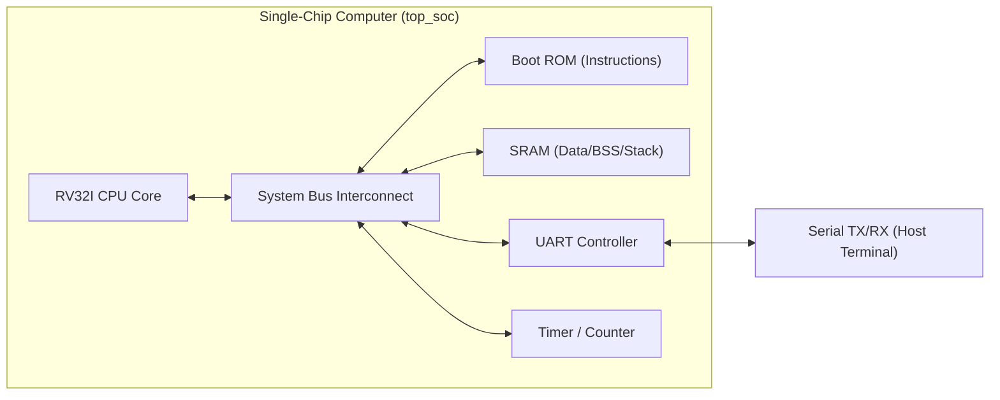
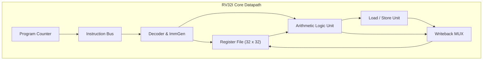

# Plan: Building a working computer system in SystemVerilog

This document outlines the architecture, hardware decomposition, software toolchain, and phased development roadmap for a self-contained computer system implemented in SystemVerilog.

## Target architecture

The recommended target is a 32-bit RISC-V processor implementing the unprivileged RV32I base integer instruction set. 

### Why RV32I fits best
- Open standard with no licensing restrictions.
- Exactly 47 instructions in the base unprivileged integer spec, requiring around 37 instructions if omitting system/fence instructions in early stages.
- Supported directly by standard GCC and Clang toolchains (`riscv32-unknown-elf-gcc`).
- Regular fixed 32-bit instruction encoding makes decoding straightforward.



## System memory map

A shared 32-bit address space simplifies software compilation and bus decoding. The bus router decodes addresses using the upper bits.

| Address Range | Size | Device | Access | Description |
|---|---|---|---|---|
| `0x0000_0000 - 0x0000_3FFF` | 16 KB | Boot ROM | Read-Only | Initial boot code, reset vector, monitor |
| `0x1000_0000 - 0x1000_FFFF` | 64 KB | Main SRAM | Read / Write | Application code, data heap, stack |
| `0x2000_0000 - 0x2000_000F` | 16 B | UART | Read / Write | TX data, RX data, status flags |
| `0x2000_0010 - 0x2000_001F` | 16 B | Hardware Timer | Read / Write | 64-bit cycle counter and compare register |

## Module decomposition

### 1. CPU Core (`rv32i_core.sv`)
Start with a single-cycle implementation before moving to a 5-stage pipeline. A single-cycle core completes one instruction per clock cycle, which eliminates pipeline stalls, branch mispredictions, and forwarding logic during initial bringup.

The core contains seven submodules:

1. **Program counter (`pc_reg.sv`)**:
   - Stores current instruction address.
   - Updates on each clock cycle: `pc <= next_pc`.
   - Supports reset vector initialization to `0x0000_0000`.

2. **Next-PC logic (`next_pc_gen.sv`)**:
   - Computes sequential address `pc + 4`.
   - Computes branch target `pc + imm_b` when branch condition evaluates true.
   - Computes jump target `pc + imm_j` for `jal`.
   - Computes indirect jump target `(rs1_data + imm_i) & ~1` for `jalr`.

3. **Instruction decoder (`decoder.sv`)**:
   - Extracts fields: `opcode` [6:0], `rd` [11:7], `funct3` [14:12], `rs1` [19:15], `rs2` [24:20], `funct7` [31:25].
   - Emits control signals: register write enable, ALU source selectors, ALU operation selector, memory read/write enables, branch type, result writeback selector.

4. **Register file (`reg_file.sv`)**:
   - 32 registers of 32 bits each.
   - Register `x0` hardwired to zero (writes to `x0` are discarded, reads return zero).
   - Two asynchronous read ports: `rs1_data = (rs1_addr == 0) ? 0 : regs[rs1_addr]`.
   - One synchronous write port enabled on clock edge.

5. **Immediate generator (`imm_gen.sv`)**:
   - Sign-extends immediate values from raw instruction formats:
     - I-type (loads, arithmetic immediates, `jalr`).
     - S-type (stores).
     - B-type (conditional branches).
     - U-type (`lui`, `auipc`).
     - J-type (`jal`).

6. **Arithmetic logic unit (`alu.sv`)**:
   - Performs operations: ADD, SUB, SLL, SLT, SLTU, XOR, SRL, SRA, OR, AND.
   - Computes zero flag and comparison flags for branch evaluation.

7. **Load/Store unit (`lsu.sv`)**:
   - Handles byte (`lb`, `lbu`), halfword (`lh`, `lhu`), and word (`lw`) memory reads.
   - Generates byte strobe signals (4-bit write mask) for `sb`, `sh`, `sw`.



### 2. Interconnect bus (`bus_interconnect.sv`)
Use a synchronous request/response protocol or a standard simple bus (such as Wishbone Classic or a simple valid-ready handshake).

Core bus signals:
- `addr` [31:0]
- `wdata` [31:0]
- `rdata` [31:0]
- `wstrb` [3:0] (byte enables for writing individual bytes)
- `valid` (initiates transfer)
- `ready` (slave acknowledges completion)

The bus interconnect routes requests based on target address:
- Directs `0x0000_xxxx` to ROM.
- Directs `0x1000_xxxx` to SRAM.
- Directs `0x2000_000x` to UART.
- Directs `0x2000_001x` to Timer.

### 3. Peripherals
- **Memory (`ram_sync.sv`)**: Single-cycle synchronous block RAM with 4-byte write strobes. Initialize via `$readmemh`.
- **UART transmitter (`uart_tx.sv`)**: Serial transmission state machine. Shifts out 8 data bits with 1 start bit, 1 stop bit, at a configurable clock divider based on system clock frequency.
- **Timer (`system_timer.sv`)**: Free-running 64-bit counter readable at `0x2000_0010`. Provides accurate timing for software delays without cycle-wasting busy loops.

## Software toolchain and boot sequence

### Toolchain setup
Install the GCC RISC-V bare-metal toolchain:
```bash
brew install riscv-gnu-toolchain
# or use prebuilt xPack GNU RISC-V Embedded GCC
```

Target compile flags:
```bash
riscv32-unknown-elf-gcc -march=rv32i -mabi=ilp32 -static -nostdlib -T link.ld crt0.s main.c -o system.elf
riscv32-unknown-elf-objcopy -O verilog system.elf system.hex
```

### Startup assembly (`crt0.s`)
The minimal boot file sets up the stack pointer and jumps to `main`:
```assembly
.section .text.init
.globl _start

_start:
    la sp, _stack_top       # Initialize stack pointer to end of RAM
    call main               # Jump to C entry point
1:  j 1b                    # Trap loop if main returns
```

### Memory-mapped C driver for serial output
```c
#define UART_TX_DATA (*(volatile unsigned int *)0x20000000)
#define UART_TX_READY (*(volatile unsigned int *)0x20000004)

void uart_putc(char c) {
    while (!UART_TX_READY);
    UART_TX_DATA = c;
}

void uart_print(const char *str) {
    while (*str) {
        uart_putc(*str++);
    }
}

int main(void) {
    uart_print("System initialized. CPU is running.
");
    return 0;
}
```

## Step-by-step implementation roadmap

### Milestone 1: ALU and register file
1. Write `alu.sv` with unit testbench covering all 10 operations and edge cases (sign extension on shifts, subtraction overflow).
2. Write `reg_file.sv`. Verify writes to register 0 never modify value. Verify simultaneous read and write behavior.

### Milestone 2: Single-cycle instruction execution
1. Build `decoder.sv` and `imm_gen.sv`.
2. Construct the datapath connecting PC, ROM, Decoder, Register File, and ALU.
3. Test initial arithmetic instructions (`addi`, `add`, `lui`, `ori`) using a hardcoded sequence in memory.
4. Verify register writeback in simulation waveform.

### Milestone 3: Memory and control flow
1. Add `lsu.sv` with byte masking.
2. Add branch comparator and multiplexer for `beq`, `bne`, `blt`, `bge`, `jal`, `jalr`.
3. Run a tight loop counting to 10 in assembly to verify conditional branch behavior.

### Milestone 4: Bus and peripherals
1. Implement the address router.
2. Connect UART TX register.
3. Simulate `uart_tx` to verify baud clock divider and serial framing.
4. Write assembly program to emit ASCII characters over the UART TX port.

### Milestone 5: Verification with official compliance tests
1. Pull the official RISC-V architectural tests (`riscv-arch-test`).
2. Run automated test suite in Verilator or ModelSim.
3. Compare signature memory dump against reference outputs.

### Milestone 6: Pipelining (optional extension)
After single-cycle operation is verified:
1. Divide datapath into five stages: IF (Instruction Fetch), ID (Instruction Decode), EX (Execute), MEM (Memory Access), WB (Writeback).
2. Insert pipeline registers between stages.
3. Implement hazard detection unit (load-use stall logic) and forwarding unit (EX-to-EX and MEM-to-EX forwarding).
